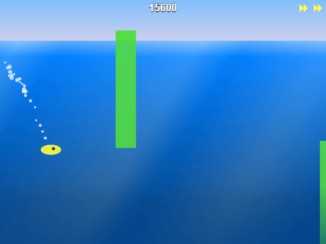

Swimmy Fish
===========

[](http://gameblog.gessojs.com/swimmy-fish)


Just keep swimming. And clicking. Swim over and under obstacles to survive as long as you can.

[Play it!](http://gameblog.gessojs.com/swimmy-fish)


Running locally
---------------

1. Install dependencies

   ```bash
   $ npm install
   ```

2. Run the development server

   ```bash
   $ npm start
   ```

Now visit [http://localhost:63550](http://localhost:63550/).
